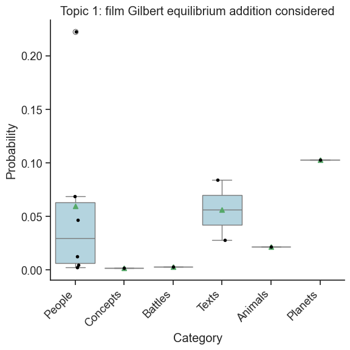
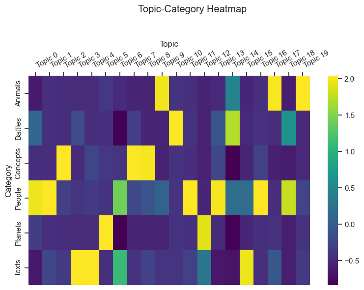
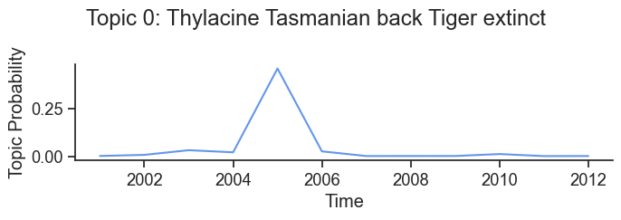
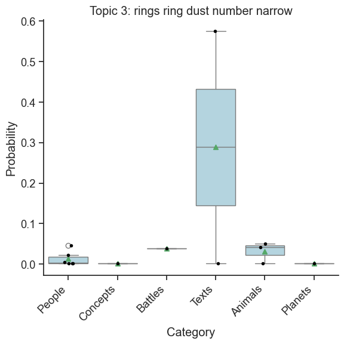

# Topic Modeling with MALLET

## Overview

Topic modeling is a statistical method for discovering abstract themes or "topics" within a collection of documents. <a href="https://mimno.github.io/Mallet/topics.html" target="_blank">MALLET</a> is a mature tool for topic modeling used widely in the Humanities. It is a Java package that needs to be installed separately from Lexos. The Lexos `mallet` module provides a straightforward wrapper for running MALLET, managing outputs, and creating visualizations of your topic model.

For more on topic modeling and installing MALLET, see Shawn Graham, Scott Weingart, and Ian Milligan's tutorial <a href="https://programminghistorian.org/en/lessons/topic-modeling-and-mallet" target="_blank">Getting Started with Topic Modeling and MALLET</a>.

The Lexos `mallet` module integrates Maria Antoniak's <a href="https://github.com/maria-antoniak/little-mallet-wrapper" target="_blank">Litte Mallet Wrapper</a> functions with a slightly simplified API that manages file paths. For more advanced methods of exploring a topic model, see the Lexos integration of [DFR Browser 2](dfr_browser2.md).

---

## Import the `Mallet` class from the `mallet` Module

First, import the `Mallet` class and helper functions from the Lexos `mallet` module.

```python
from lexos.topic_modeling.mallet import Mallet
from IPython.display import display
```

---

## Check Mallet Installation

Verify that MALLET is installed and accessible by calling the MALLET binary.

If you are using a Jupyter notebook, you can configure the path to your MALLET binary and run

```python
mallet_binary_path = "/path/to/mallet"
!$mallet_binary_path
```

If you receive a list of commands, MALLET is installed and the path is correct.

Or on the command line, type the path to your MALLET binary and hit Enter. You should see the same list of commands.

---

## Load Your Data

Your data must take the form of a list of strings or spaCy `Doc` objects. Example data:

```python
sample_docs = [
    "The quick brown fox jumps over the lazy dog.",
    "Never jump over the lazy dog quickly.",
    "A fast brown fox leaps over sleeping dogs.",
    "Dogs are great pets for families.",
    "Foxes are wild animals found in forests."
]
```

You will see the command sent to MALLET in the output.

### Reading Directories

The `read_dirs()` function will read all text files in a directory (or list of directories) into a list of strings. Each file will be treated as a separate document. Note that the order of the documents in the list is important, as it will be used for document indexes in the topic model.

In the examples below, we will use the `sample_data` folder distributed with MALLET, which contains text from 12 Wikipedia articles.

```python
from lexos.topic_modeling.mallet import read_dirs
corpus_dir = "sample_data"
docs = read_dirs(corpus_dir)
for doc in docs[:5]:
    print(f"- {doc[0:100]}...")
```

### Reading from a File

You can also load documents from a single file using the `read_file()` function. Here each line in the file will be treated as a separate document. Again, the order of documents will be used for document indexes in the topic model.

Note: Technically, MALLET expects the tab-delimited file where the first column is an index, the second is an optional label, and the third is the document text itself. The `read_file()` function accepts files in this format, as well as files containing only texts.

```python
from lexos.topic_modeling.mallet import read_file
corpus_file = "sample_data.txt"
docs = read_file(corpus_file)
for doc in docs[:5]:
    print(f"- {doc[0:100]}...")
```

---

## Train a Topic Model

You are now ready to train a topic model. This involves three steps:

1. Create a topic model involves three steps illustrated below. First, create a `Mallet` instance, providing it with the path to a directory to save the model and, if required (see above), the path to your Mallet binary file.
2. Next, import your data with the `import_data()` method.
3. Finally, train the topic model.

The model `metadata` property returns a dictionary containing paths to output files and model statistics.

Start by creating a `Mallet` instance:

```python
model_dir = "mallet_model"
path_to_mallet = "/path/to/your/mallet/binary"
mallet_model = Mallet(model_dir=model_dir, path_to_mallet=path_to_mallet)
```

Now import your training data with `import_data`.

```python
mallet_model.import_data(training_data=docs)
```

You can configure the following parameters:

- `keep_sequence`: Keep the token sequence. Default is `True`.
- `preserve_case`: Preserve case. Default is `True`.
- `remove_stopwords`: Remove stopwords. Default is `True`.
- `training_ids`: A list of integers indicating the IDs of the documents you want to import. If `None`, all documents in your training data will be imported.

When you train a model, MALLET creates a "pipe" file that records the sequence of data processing steps (such as tokenization, stopword removal, case normalization, etc.). This file is saved in your model directory with the extension `.mallet`.

If you later want to import new documents for inference or further modeling, you can use `use_pipe_from` with the path to the `.mallet` file. This guarantees consistency between training and inference, so your new documents are handled identically to your training set.

Finally, train your model:

```python
mallet_model.train(num_topics=20, num_iterations=100, verbose=True)
```

If `verbose` is set to `True`, you will see something like:

```bash
✔ Training topics...
Mallet LDA: 20 topics, 5 topic bits, 11111 topic mask
Data loaded.
max tokens: 147
total tokens: 1245
<10> LL/token: -9.11285
<20> LL/token: -8.87062
<30> LL/token: -8.71832
<40> LL/token: -8.61369

0       0.25    average Test energy Hill energies ended innings batsman day predictions accurate holds neutron
properties predict Dulong–Petit classical mechanics statistical handicapper
1       0.25    back Gilbert year actors drama Greek productions England movie accomplishments romance Actress
graduating retiring apex habitat introduction continent mainland commonly

...

Total time: 0 seconds

✔ Complete
```

This is a display of the state of your model after each iteration. It can be quite long, so it may be truncated in a notebook environment. If you are not interested in observing this output, you can set `verbose=False`.

The `train()` method takes the following parameters:

- `num_topics`: The number of topics to train. The default is 20.
- `num_iterations`: The number of iterations to train for. The default is 100.
- `optimize_interval`: The interval at which to optimize the model. The default is 10.
- `verbose`: Whether to print the MALLET output showing the state at different iterations. The default is `True`.
- `path_to_inferencer`: Optional output filename for saving a trained inferencer object (see below). If not provided, defaults to `model_dir/inferencer.mallet`.

---

## After Training

After training, you can inspect various model properties:

- `mallet_model.metadata`: Returns a dictionary of information about the model, especially the paths and commands that were used to generate the model.
- `mallet_model.topic_keys`: A list of lists where each sublist is the topic keys for a given topic.
- `mallet_model.distributions`: A list of lists where each inner list is the topic distribution for a single document: how much each topic contributes to the document (sums to 1).
- `mallet_model.num_docs`: The number of documents used to generate the model.
- `mallet_model.vocab_size`: The number of unique terms used by the trained model.
- `mallet_model.mean_num_tokens`: The mean number of tokens per document.

These properties allow you to inspect the model, analyze results, and use outputs for further processing.

---

## Display Topics and Top Words

Once you have created your model, you can display the discovered topics and their top words using `get_keys()`. This method takes the following parameters:

- `num_topics`: The number of topics to get keys for. If `None`, get keys for all topics.
- `topics`: A list of topic indices to get keys for. If `None`, get keys for all topics.
- `num_keys`: The number of key terms to output for each topic.
- `as_df`: Whether to return the result as a pandas DataFrame instead of a string. The default is `True`.

```python
mallet_model.get_keys(as_df=True)
```

|    |   Topic |   Label | Keywords                                                                                     |
|---:|--------:|--------:|:---------------------------------------------------------------------------------------------|
|  0 |       0 |    0.25 | Test cricket Hill South top-grossing year runs team batsman played                           |
|  1 |       1 |    0.25 | film Gilbert equilibrium addition considered original News movie Alvida Kabhi                |
|  2 |       2 |    0.25 | London time Needham series critical men Grant's Grant values forms                           |
|  3 |       3 |    0.25 | died return run Paris Davis lobby traveled governor brigade Commonwealth's                   |
|  4 |       4 |    0.25 | Edward survived Richard invaded Dil born collisional originated exosphere—corona aerodynamic |
|  5 |       5 |    0.25 | back general Thespis Greek Sullivan practice allegiance swore captured Bragg's               |
|  6 |       6 |    0.25 | Zinta role Indian acting Kehna Award Filmfare earned films performances                      |
|  7 |       7 |    0.25 | Thylacine Tiger extinct pouch found related Tasmania marsupial Thylacinus stability          |
|  8 |       8 |    0.25 | Tasmanian modern reported Devil species century teenage cricketers helping discord           |
|  9 |       9 |    0.25 | Norway king including journalist spent husband details Saga figure subsequently              |
| 10 |      10 |    0.25 | Hindi Naa actress innings drama Punjab Kings Wadia Ness boyfriend                            |
| 11 |      11 |    0.25 | Yard National wilderness standards Parks Service movement invasion interrupted Governor      |
| 12 |      12 |    0.25 | rings system ring dust moons narrow Uranian particles discovered Uranus                      |
| 13 |      13 |    0.25 | Echo Sunderland World paper Thomas Storey East newspaper boycott Triangular                  |
| 14 |      14 |    0.25 | Gunnhild life Orkney Erik mother outbreak Telugu specific formula episodes                   |
| 15 |      15 |    0.25 | Union Gen battle Confederates War line position Maj launched Beauregard                      |
| 16 |      16 |    0.25 | death States United numerous Tennessee American national neutrality park late                |
| 17 |      17 |    0.25 | years Australian career record including England ended scored involved worked                |
| 18 |      18 |    0.25 | Hawes Confederate Kentucky Army Battle ceremony Commonwealth Virginia Whig fighting          |
| 19 |      19 |    0.25 | equipartition theorem average energy kinetic system effects stars law classical              |

---

## Display the Top Documents in Each Topic

You can display the discovered topics and their top words using `get_top_docs()`. This method takes the following parameters:

- `topic`: The topic number to display.
- `n`: The number of top documents to return.
- `metadata`: A Dataframe with the metadata in the same order as the training data. This can include information such as document labels.
- `as_str`: Whether to return the result as a string instead of a pandas DataFrame. The default is `False`.

```python
mallet_model.get_top_docs(topic=0, n=10)
```

| Doc ID | Distribution | Document                                                                                                                                                                                                                                                                                                                                                                                                                                                                                                                                                                                                                                                                                                                                                                                                                                                                                                                                                                                                                                                                                                                                                                                                                                                                                                                                                                                                                                                                            |
|-------:|-------------:|:------------------------------------------------------------------------------------------------------------------------------------------------------------------------------------------------------------------------------------------------------------------------------------------------------------------------------------------------------------------------------------------------------------------------------------------------------------------------------------------------------------------------------------------------------------------------------------------------------------------------------------------------------------------------------------------------------------------------------------------------------------------------------------------------------------------------------------------------------------------------------------------------------------------------------------------------------------------------------------------------------------------------------------------------------------------------------------------------------------------------------------------------------------------------------------------------------------------------------------------------------------------------------------------------------------------------------------------------------------------------------------------------------------------------------------------------------------------------------------|
|      8 |     0.435096 | Clem Hill (1877–1945) was an Australian cricketer who played 49 Test matches as a specialist batsman between 1896 and 1912. He captained the Australian team in ten Tests, winning five and losing five. A prolific run scorer, Hill scored 3,412 runs in Test cricket—a world record at the time of his retirement—at an average of 39.21 per innings, including seven centuries. In 1902, Hill was the first batsman to make 1,000 Test runs in a calendar year, a feat that would not be repeated for 45 years. His innings of 365 scored against New South Wales for South Australia in 1900–01 was a Sheffield Shield record for 27 years. His Test cricket career ended in controversy after he was involved in a brawl with cricket administrator and fellow Test selector Peter McAlister in 1912. He was one of the "Big Six", a group of leading Australian cricketers who boycotted the 1912 Triangular Tournament in England when the players were stripped of the right to appoint the tour manager. The boycott effectively ended his Test career. After retiring from cricket, Hill worked in the horse racing industry as a stipendiary steward and later as a handicapper for races including the Caulfield Cup.                                                                                                                                                                                                                                                   |
|     10 |      0.12037 | Preity Zinta (born 1975) is an Indian film actress. She has appeared in Hindi films of Bollywood, as well as Telugu and English-language movies. After graduating with a degree in criminal psychology, Zinta made her acting debut in Dil Se in 1998 followed by a role in Soldier the same year. These performances earned her a Filmfare Best Female Debut Award, and she was later recognised for her role as a teenage single mother in Kya Kehna (2000). She subsequently played a variety of character types, and in doing so has been credited with changing the image of a Hindi film heroine. Zinta received her first Filmfare Best Actress Award in 2003 for her performance in the drama Kal Ho Naa Ho. She went on to play the lead female role in two consecutive annual top-grossing films in India: the science fiction film Koi... Mil Gaya, her biggest commercial success, and the star-crossed romance Veer-Zaara, which earned her critical acclaim. She was later noted for her portrayal of independent, modern Indian women in Salaam Namaste and Kabhi Alvida Naa Kehna, top-grossing productions in overseas markets. These accomplishments have established her as a leading actress of Hindi cinema. In addition to movie acting, Zinta has written a series of columns for BBC News Online South Asia, is a regular stage performer, and along with boyfriend Ness Wadia she is a co-owner of the Indian Premier League cricket team Kings XI Punjab. |
|      3 |   0.00431034 | Elizabeth Needham (died 3 May 1731), also known as Mother Needham, was an English procuress and brothel-keeper of 18th-century London, who has been identified as the bawd greeting Moll Hackabout in the first plate of William Hogarth\'s series of satirical etchings, A Harlot\'s Progress. Although Needham was notorious in London at the time, little is recorded of her life, and no genuine portraits of her survive. Her house was the most exclusive in London and her customers came from the highest strata of fashionable society, but she eventually crossed the moral reformers of the day and died as a result of the severe treatment she received after being sentenced to stand in the pillory.                                                                                                                                                                                                                                                                                                                                                                                                                                                                                                                                                                                                                                                                                                                                                                 |
|      5 |   0.00294118 | Gunnhild konungamóðir (mother of kings) or Gunnhild Gormsdóttir[1] (c. 910  –  c. 980) was the wife of Erik Bloodaxe (king of Norway 930–34, "king" of Orkney c. 937–54, and king of Jórvík 948–49 and 952–54). Gunnhild is a prominent figure in many Norse sagas, including Fagrskinna, Egil\'s Saga, Njal\'s Saga, and Heimskringla. Many of the details of her life are disputed, including her parentage. Gunnhild lived during a time of great change in Norway. Her father-in-law Harald Fairhair had recently united much of Norway under his rule. Shortly after his death, Gunnhild and her husband were overthrown and exiled. She spent much of the rest of her life in exile in Orkney, Jorvik and Denmark. A number of her many children with Erik became co-rulers of Norway in the late tenth century. What details of her life are known come largely from Icelandic sources; because the Icelanders were generally hostile to her and her husband, scholars regard some of the episodes reported in them as suspect.                                                                                                                                                                                                                                                                                                                                                                                                                                              |
|      2 |       0.0025 | Thespis is an operatic extravaganza that was the first collaboration between dramatist W. S. Gilbert and composer Arthur Sullivan. It was never published, and most of the music is now lost. However, Gilbert and Sullivan went on to become one of the most famous and successful partnerships in Victorian England, creating a string of comic opera hits, including H.M.S. Pinafore, The Pirates of Penzance and The Mikado, that continue to be popular. Thespis premièred in London at the Gaiety Theatre on 26 December 1871. Like many productions at that theatre, it was written in a broad, burlesque style, considerably different from Gilbert and Sullivan\'s later works. It was a modest success—for a Christmas entertainment of the time—and closed on 8 March 1872, after a run of 63 performances. It was advertised as "An entirely original Grotesque Opera in Two Acts". The story follows an acting troupe headed by Thespis, the legendary Greek father of the drama, who temporarily trade places with the gods on Mount Olympus, who have grown elderly and ignored. The actors turn out to be comically inept rulers. Having seen the ensuing mayhem down below, the angry gods return, sending the actors back to Earth as "eminent tragedians, whom no one ever goes to see."                                                                                                                                                                         |
|      9 |       0.0025 | The equipartition theorem is a formula from statistical mechanics that relates the temperature of a system with its average energies. The original idea of equipartition was that, in thermal equilibrium, energy is shared equally among its various forms; for example, the average kinetic energy in the translational motion of a molecule should equal the average kinetic energy in its rotational motion. Like the virial theorem, the equipartition theorem gives the total average kinetic and potential energies for a system at a given temperature, from which the system\'s heat capacity can be computed. However, equipartition also gives the average values of individual components of the energy. It can be applied to any classical system in thermal equilibrium, no matter how complicated. The equipartition theorem can be used to derive the classical ideal gas law, and the Dulong–Petit law for the specific heat capacities of solids. It can also be used to predict the properties of stars, even white dwarfs and neutron stars, since it holds even when relativistic effects are considered. Although the equipartition theorem makes very accurate predictions in certain conditions, it becomes inaccurate when quantum effects are significant, namely at low enough temperatures.                                                                                                                                                             |
|      0 |   0.00247525 | The Sunderland Echo is an evening provincial newspaper serving the Sunderland, South Tyneside and East Durham areas of North East England. The newspaper was founded by Samuel Storey, Edward Backhouse, Edward Temperley Gourley, Charles Palmer, Richard Ruddock, Thomas Glaholm and Thomas Scott Turnbull in 1873, as the Sunderland Daily Echo and Shipping Gazette. Designed to provide a platform for the Radical views held by Storey and his partners, it was also Sunderland\'s first local daily paper. The inaugural edition of the Echo was printed in Press Lane, Sunderland on 22 December 1873; 1,000 copies were produced and sold for a halfpenny each. The Echo survived intense competition in its early years, as well as the depression of the 1930s and two World Wars. Sunderland was heavily bombed in the Second World War and, although the Echo building was undamaged, it was forced to print its competitor\'s paper under wartime rules. It was during this time that the paper\'s format changed, from a broadsheet to its current tabloid layout, because of national newsprint shortages.                                                                                                                                                                                                                                                                                                                                                          |
|      7 |   0.00227273 | The rings of Uranus were discovered on March 10, 1977, by James L. Elliot, Edward W. Dunham, and Douglas J. Mink. Two additional rings were discovered in 1986 by the Voyager 2 spacecraft, and two outer rings were found in 2003–2005 by the Hubble Space Telescope. A number of faint dust bands and incomplete arcs may exist between the main rings. The rings are extremely dark—the Bond albedo of the rings\' particles does not exceed 2%. They are likely composed of water ice with the addition of some dark radiation-processed organics. The majority of Uranus\'s rings are opaque and only a few kilometres wide. The ring system contains little dust overall; it consists mostly of large bodies 0.2–20 m in diameter. The relative lack of dust in the ring system is due to aerodynamic drag from the extended Uranian exosphere—corona. The rings of Uranus are thought to be relatively young, at not more than 600 million years. The mechanism that confines the narrow rings is not well understood. The Uranian ring system probably originated from the collisional fragmentation of a number of moons that once existed around the planet. After colliding, the moons broke up into numerous particles, which survived as narrow and optically dense rings only in strictly confined zones of maximum stability.                                                                                                                                        |
|     11 |   0.00227273 | Richard Hawes (1797–1877) was a United States Representative from Kentucky and the second Confederate Governor of Kentucky. Originally a Whig, Hawes became a Democrat following the dissolution of the Whig party in the 1850s. At the outbreak of the American Civil War, Hawes was a supporter of Kentucky\'s doctrine of armed neutrality. When the Commonwealth\'s neutrality was breached in September 1861, Hawes fled to Virginia and enlisted as a brigade commissary under Confederate general Humphrey Marshall. He was elected Confederate governor of the Commonwealth following the late George W. Johnson\'s death at the Battle of Shiloh. Hawes and the Confederate government traveled with Braxton Bragg\'s Army of Tennessee, and when Bragg invaded Kentucky in October 1862, he captured Frankfort and held an inauguration ceremony for Hawes. The ceremony was interrupted, however, by forces under Union general Don Carlos Buell, and the Confederates were driven from the Commonwealth following the Battle of Perryville. Hawes relocated to Virginia, where he continued to lobby President Jefferson Davis to attempt another invasion of Kentucky. Following the war, he returned to his home in Paris, Kentucky, swore an oath of allegiance to the Union, and was allowed to return to his law practice.                                                                                                                                         |
|      6 |   0.00215517 | Robert Sterling Yard (1861–1945) was an American writer, journalist and wilderness activist. Yard graduated from Princeton University and spent the first twenty years of his career as a journalist, editor and publisher. In 1915 he was recruited by his friend Stephen Mather to help publicize the need for an independent national park agency. Their numerous publications were part of a movement that resulted in legislative support for a National Park Service in 1916. Yard served as head of the National Parks Educational Committee for several years after its conception, but tension within the NPS led him to concentrate on non-government initiatives. He became executive secretary of the National Parks Association in 1919. Yard worked to promote the national parks as well as educate Americans about their use. Creating high standards based on aesthetic ideals for park selection, he also opposed commercialism and industrialization of what he called "America\'s masterpieces". These standards caused discord with his peers. After helping to establish a relationship between the NPA and the United States Forest Service, Yard later became involved in the protection of wilderness areas. In 1935 he became one of the eight founding members of The Wilderness Society and acted as its first president from 1937 until his death eight years later. Yard is now considered an important figure in the modern wilderness movement.     |

---

## Display the Topic Term Probabilities

You can display the the term distribution for a given topic with `get_topic_term_probabilities()`. This method takes the following parameters:

- `topics`: The topic number (or list of topic numbers) to display. If None, get the probabilities for all topics.
- `n`: The number of key terms to display.
- `as_df`: Whether to return the result as a string instead of a pandas DataFrame. The default is `False`.

```python
mallet_model.get_topic_term_probabilities(topics=[0, 1], n=10, as_df=True)
```

|    | Topic | Term          | Probability |
|---:|------:|:--------------|------------:|
|  0 |     0 | Test          |   0.0856613 |
|  1 |     0 | Hill          |   0.0571551 |
|  2 |     0 | cricket       |   0.0571551 |
|  3 |     0 | South         |   0.0429019 |
|  4 |     0 | played        |   0.0286488 |
|  5 |     0 | batsman       |   0.0286488 |
|  6 |     0 | team          |   0.0286488 |
|  7 |     0 | runs          |   0.0286488 |
|  8 |     0 | year          |   0.0286488 |
|  9 |     0 | top-grossing  |   0.0286488 |
| 10 |     1 | Gilbert       |    0.042299 |
| 11 |     1 | film          |    0.042299 |
| 12 |     1 | original      |   0.0282462 |
| 13 |     1 | considered    |   0.0282462 |
| 14 |     1 | addition      |   0.0282462 |
| 15 |     1 | equilibrium   |   0.0282462 |
| 16 |     1 | intense       |   0.0141934 |
| 17 |     1 | collaboration |   0.0141934 |
| 18 |     1 | composer      |   0.0141934 |
| 19 |     1 | published     |   0.0141934 |

---

## Visualizing Topic Probabilities by Category with Boxplots

The `plot_categories_by_topic_boxplots()` method lets you visualize how topic probabilities are distributed across different categories (e.g., genres, labels, or other groupings). This is useful for understanding which topics are most associated with which categories in your data.

The function takes a number of parameters that allow you to choose your topics and categories, as well as to customize the appearance of the box plots.

- `categories`: List of category labels for each document (must match the order of your training data).
- `topics`: Topic index or list of indices to plot. If `None`, all topics are plotted.
- `output_path`: Path to save the figure. If `None`, the plot is shown but not saved.
- `target_labels`: List of unique category labels to include. If `None`, all categories are included.
- `num_keys`: Number of top keywords to display in the plot title.
- `figsize`: Size of the figure (tuple, e.g., `(8, 6)`).
- `font_scale`: Font scaling for the plot.
- `color`: Color for the boxplots (matplotlib color name or object).
- `show`: Whether to display the plot (`True`) or just return the figure object (`False`).
- `title`: Custom title for the plot. If not provided, a default is used.
- `overlay`: How to display individual data points (`'strip'`, `'swarm'`, or `'none'`).
- `overlay_kws`: Dictionary of keyword arguments for the overlay plot (e.g., point size, color).

**Overlay advice:**

- Use `'strip'` (default) for most cases, especially when you have a moderate number of documents per category. It shows individual points with jitter for visibility.
- Use `'swarm'` when you have a small number of documents and want to avoid overlapping points; it arranges points to minimize overlap.
- Use `'none'` if you only want to see the boxplot summary and not individual data points (useful for large datasets).

The cell below will run a basic example.

```python
categories = ["People", "Concepts", "People", "People", "People", "Battles", "Texts", "Texts", "Animals", "Planets", "People", "People"]
mallet_model.plot_categories_by_topic_boxplots(categories)
```



---

## Visualizing Topic-Category Associations with a Heatmap

The `plot_categories_by_topics_heatmap()` method creates a heatmap showing how topics are distributed across different categories. This is useful for quickly spotting which topics are most associated with which categories, especially when you have many topics or categories. It takes the following parameters:

- `categories`: List of category labels for each document (must match the order of your training data).
- `output_path`: Path to save the figure. If `None`, the plot is shown but not saved.
- `target_labels`: List of unique category labels to include. If `None`, all categories are included.
- `num_keys`: Number of top keywords to display in the topic labels.
- `figsize`: Size of the figure (tuple, e.g., `(10, 8)`).
- `font_scale`: Font scaling for the plot.
- `cmap`: Colormap for the heatmap (e.g., `"rocket_r"`, `"viridis"`, or any matplotlib colormap).
- `show`: Whether to display the plot (`True`) or just return the figure object (`False`).
- `title`: Custom title for the plot. If not provided, a default is used.

```python
categories = ["People", "Concepts", "People", "People", "People", "Battles", "Texts", "Texts", "Animals", "Planets", "People", "People"]
mallet_model.plot_categories_by_topics_heatmap(
    categories=categories,
    num_keys=3,
    figsize=(8, 6),
    font_scale=1,
    cmap="viridis",
    show=True,
    title="Topic-Category Heatmap"
)
```



!!! Note
    If you make the figure size too small, some topic labels may be omitted. You can mitigate this by reducting the font scale.

---

## Visualizing Topics with Word Clouds

The `topic_clouds()` method in the Mallet class generates word clouds for each topic, providing a visual summary of the most important terms per topic. This is useful for quickly understanding the main themes captured by your model.

**Parameters:**

- `topics`: (int or list[int], optional) Topics to include. If None, all topics are shown.
- `max_terms`: (int, optional) Maximum number of keywords per topic cloud (default: 30).
- `figsize`: (tuple, optional) Size of the overall figure (default: (10, 10)).
- `output_path`: (str, optional) If provided, saves the figure to this path.
- `show`: (bool, optional) If True, displays the figure; if False, returns the matplotlib Figure object.
- `round_mask`: (bool|int|str, optional) Whether to use a circular mask for the clouds (True/False or integer radius).
- `title`: (str, optional) Title for the figure.
- `**kwargs`: Additional keyword arguments for customization (see below).

**Customization:**

- Pass `opts` in `**kwargs` to control word cloud appearance (e.g., background color, colormap). Accepts arguments for the Python <a href="https://amueller.github.io/word_cloud/generated/wordcloud.WordCloud.html#wordcloud.WordCloud" target="_blank">wordcloud</a> package.
- Pass `figure_opts` in `**kwargs` to control figure-level options using `matplotlib` (e.g., facecolor).

```python
mallet_model.topic_clouds(show=True)
```


## Visualizing Topic Trends Over Time

The `plot_topics_over_time()` method in the Mallet class allows you to visualize how the probability of a specific topic changes across a sequence of documents, such as those ordered by time or another variable. This is useful for exploring temporal or sequential patterns in your corpus.

**Parameters:**

- `times`: (list) Sequence of time points or other ordering variable, one per document.
- `topic_index`: (int) The topic to plot (0-based index).
- `topic_distributions`: (list[list[float]], optional) Topic distributions per document. If None, uses the model's distributions.
- `topic_keys`: (list[list[str]], optional) Topic keys. If None, uses the model's keys.
- `output_path`: (str, optional) If provided, saves the figure to this path.
- `figsize`: (tuple, optional) Size of the figure (default: (7, 2.5)).
- `font_scale`: (float, optional) Seaborn font scale (default: 1.2).
- `color`: (str, optional) Line color (default: "cornflowerblue").
- `show`: (bool, optional) If True, displays the figure; if False, returns the matplotlib Figure object.
- `title`: (str, optional) Title for the figure. If not supplied, uses topic keywords.

**Note:**

- The `times` list must be the same length as the number of documents.

```python
times = [2001, 2002, 2003, 2004, 2005, 2006, 2007, 2008, 2009, 2010, 2011, 2012]
mallet_model.plot_topics_over_time(times=times, topic_index=0, show=True)
```



---

## Advanced: Infer Topics for New Documents

Sometimes you want train a model and then feed it new documents after training. To help you do this, Lexos creates an inferencer file when you initially train the model. It will automatically be saved as `inferencer.mallet` in your model's folder, but you can use the `path_to_inferencer` parameter if you want to save its somewhere else.

```python
import os
new_docs = [
    "A fox runs quickly through the forest.",
    "Dogs are loyal and friendly pets."
]
pipe_file = os.path.join(mallet_model.model_dir, "training_data.mallet")
output_path = os.path.join(mallet_model.model_dir, "new_doc_topics.txt")
path_to_inferencer = mallet_model.metadata['path_to_inferencer']
inferred_topics = mallet_model.infer(
    new_docs,
    path_to_inferencer=path_to_inferencer,
    use_pipe_from=pipe_file,
    output_path=output_path
)
for i, dist in enumerate(inferred_topics):
    print(f"Document {i}: {dist}\n")
```

This will output

```txt
First Two Distributions:
Document 0: [0.041666666666666664, 0.041666666666666664, 0.041666666666666664, 0.041666666666666664, 0.041666666666666664, 0.041666666666666664, 0.041666666666666664, 0.041666666666666664, 0.041666666666666664, 0.041666666666666664, 0.20833333333333334, 0.041666666666666664, 0.041666666666666664, 0.041666666666666664, 0.041666666666666664, 0.041666666666666664, 0.041666666666666664, 0.041666666666666664, 0.041666666666666664, 0.041666666666666664]

Document 1: [0.05, 0.05, 0.05, 0.05, 0.05, 0.05, 0.05, 0.05, 0.05, 0.05, 0.05, 0.05, 0.05, 0.05, 0.05, 0.05, 0.05, 0.05, 0.05, 0.05]
```

Next, use the inferencer to infer new topic distributions. You will need to define the following paths:

- `pipe_file`: Path to the `.mallet` pipe file created during training. Ensures new documents are processed identically to training data.
- `output_path`: Where to save the topic distributions for the new documents (as a text file).
- path_to_inferencer`: Path to the inferencer file created during training. This is used to infer topics for new documents.

In the code below, we use the default paths that should have been created in your model folder.

```python
all_distributions = mallet_model.distributions + inferred_topics
categories_training = ["People", "Concepts", "People", "People", "People", "Battles", "Texts", "Texts", "Animals", "Planets", "People", "People"]
categories_new = ["Animals", "Animals"]
all_categories = categories_training + categories_new
```

Now we can use any of the visualization methods. For instance, here are boxplots for the combined distributions:

```python
mallet_model.plot_categories_by_topic_boxplots(
    topics=3,
    categories=all_categories,
    topic_distributions=all_distributions,  # Pass the combined distributions
    show=True
)
```



The code below will produce heatmap and topic over time visualizations.

```python
mallet_model.plot_categories_by_topics_heatmap(
    all_categories,
    topic_distributions=all_distributions,
    num_keys=3,
    figsize=(8, 6),
    font_scale=1,
    cmap="viridis",
    show=True,
    title="Topic-Category Heatmap (Combined Distributions)"
)
```


```python
times = [2001, 2002, 2003, 2004, 2005, 2006, 2007, 2008, 2009, 2010, 2011, 2012, 2013, 2014]
mallet_model.plot_topics_over_time(
    times=times,
    topic_index=0,
    topic_distributions=all_distributions,
    title="Topic 0 Trend (Combined Distributions)",
    color="blue",
    figsize=(10, 3),
    show=True
)
```


