# Topic Modeling with MALLET

## Overview

Topic modeling is a statistical method for discovering abstract themes or "topics" within a collection of documents. <a href="https://mimno.github.io/Mallet/topics.html" target="_blank">MALLET</a> is a mature tool for topic modeling used widely in the Humanities. It is a Java package that needs to be installed separately from Lexos. The Lexos `mallet` module provides a straightforward wrapper for running MALLET, managing outputs, and creating visualizations of your topic model.

For more on topic modeling and installing MALLET, see Shawn Graham, Scott Weingart, and Ian Milligan's tutorial <a href="https://programminghistorian.org/en/lessons/topic-modeling-and-mallet" target="_blank">Getting Started with Topic Modeling and MALLET</a>.

The Lexos `mallet` module integrates Maria Antoniak's <a href="https://github.com/maria-antoniak/little-mallet-wrapper" target="_blank">Litte Mallet Wrapper</a> functions with a slightly simplified API that manages file paths. For more advanced methods of exploring a topic model, see the Lexos integration of [DFR Browser 2](dfr_browser2.md).

In the examples below, we will use a sample dataset of English-language fiction from David Bamman's [LitBank](https://github.com/DBamman/litbank). Additional texts were collected by Allen Riddell for [TAToM: Text Analysis with Topic Models for the Humanities and Social Sciences](https://github.com/ariddell/tatom).

---

## Import the `Mallet` class from the `mallet` Module

First, import the `Mallet` class and helper functions from the Lexos `mallet` module.

```python
from lexos import Mallet
from lexos.topic_modeling.mallet import import_docs, import_files, read_file, read_dirs
```

---

## Check Mallet Installation

Verify that MALLET is installed and accessible by calling the MALLET binary. For instance, if your MALLET binary is located at `~/mallet/bin`, you can run the following command in a terminal:

```bash
~/mallet/bin/mallet
```

If you are using a Jupyter notebook, you can configure the path to your MALLET binary and run

```python
mallet_binary_path = "/path/to/mallet"
!$mallet_binary_path
```

If you receive a list of commands, MALLET is installed and the path is correct.

Or on the command line, type the path to your MALLET binary and hit Enter. You should see the same list of commands.

---

## Load Your Data

Your data must take the form of a list of strings or spaCy `Doc` objects. Example data:

```python
sample_docs = [
    "The quick brown fox jumps over the lazy dog.",
    "Never jump over the lazy dog quickly.",
    "A fast brown fox leaps over sleeping dogs.",
    "Dogs are great pets for families.",
    "Foxes are wild animals found in forests."
]

training_data = import_docs(sample_docs)
```

This just copies the list `sample_docs` into a new list called `training_data` but ensures that the raw text strings are copied if your sample docs are spaCy `Doc` objects.

Because topic modelling normally uses a large number of documents, you will most likely want to import them from a directory or line-delimited file. The `read_dirs()` and `read_file()` functions will read your documents into a list of strings.

### Reading Directories

The `read_dirs()` function will read all text files in a directory (or list of directories) into a list of strings where each file is treated as a separate document. Note that the order of the documents in the list is important, as it will be used for document indexes in the topic model.

In the examples below, we will use the `litbank_texts` folder distributed with MALLET, which contains text from 12 Wikipedia articles.

```python
from lexos.topic_modeling.mallet import read_dirs
corpus_dir = "litbank_texts"
training_data = read_dirs(corpus_dir)
```

### Reading from a File

You can also load documents from a single file using the `read_file()` function. Here each line in the file is treated as a separate document. Again, the order of documents will be used for document indexes in the topic model.

Note: Technically, MALLET expects the tab-delimited file where the first column is an index, the second is an optional label, and the third is the document text itself. The `read_file()` function accepts files in this format, as well as files containing only texts.

```python
from lexos.topic_modeling.mallet import read_file
corpus_file = "sample_data.txt"
training_data = read_file(corpus_file)
```

---

## Train a Topic Model

You are now ready to train a topic model. This involves three steps:

1. Create a topic model involves three steps illustrated below. First, create a `Mallet` instance, providing it with the path to a directory to save the model and, if required (see above), the path to your Mallet binary file.
2. Next, import your data with the `import_data()` method.
3. Finally, train the topic model.

The model `metadata` property returns a dictionary containing paths to output files and model statistics.

Start by creating a `Mallet` instance:

```python
model_dir = "mallet_model"
path_to_mallet = "/path/to/your/mallet/binary"
mallet_model = Mallet(model_dir=model_dir, path_to_mallet=path_to_mallet)
```

Now import your training data into the model instance with `import_data`.

```python
mallet_model.import_data(training_data=training_data)
```

You can configure the following parameters:

- `keep_sequence`: Keep the token sequence. Default is `True`.
- `preserve_case`: Preserve case. Default is `True`.
- `remove_stopwords`: Remove stopwords. Default is `True`.
- `training_ids`: A list of integers indicating the IDs of the documents you want to import. If `None`, all documents in your training data will be imported.

When you train a model, MALLET creates a "pipe" file that records the sequence of data processing steps (such as tokenization, stopword removal, case normalization, etc.). This file is saved in your model directory with the extension `.mallet`.

If you later want to import new documents for inference or further modeling, you can use `use_pipe_from` with the path to the `.mallet` file. This guarantees consistency between training and inference, so your new documents are handled identically to your training set.

Finally, train your model:

```python
mallet_model.train(num_topics=20, num_iterations=100, verbose=True)
```

If `verbose` is set to `True`, you will see something like:

```bash
✔ Training topics...
Mallet LDA: 20 topics, 5 topic bits, 11111 topic mask
Data loaded.
max tokens: 147
total tokens: 1245
<10> LL/token: -9.11285
<20> LL/token: -8.87062
<30> LL/token: -8.71832
<40> LL/token: -8.61369

0       0.25    average Test energy Hill energies ended innings batsman day predictions accurate holds neutron
properties predict Dulong–Petit classical mechanics statistical handicapper
1       0.25    back Gilbert year actors drama Greek productions England movie accomplishments romance Actress
graduating retiring apex habitat introduction continent mainland commonly

...

Total time: 0 seconds

✔ Complete
```

This is a display of the state of your model after each iteration. It can be quite long, so it may be truncated in a notebook environment. If you are not interested in observing this output, you can set `verbose=False`.

The `train()` method takes the following parameters:

- `num_topics`: The number of topics to train. The default is 20.
- `num_iterations`: The number of iterations to train for. The default is 100.
- `optimize_interval`: The interval at which to optimize the model. The default is 10.
- `verbose`: Whether to print the MALLET output showing the state at different iterations. The default is `True`.
- `path_to_inferencer`: Optional output filename for saving a trained inferencer object (see below). If not provided, defaults to `model_dir/inferencer.mallet`.

---

## Loading an Existing Model

Sometimes you need to load an existing model into memory, rather than creating one from scratch. You can do this easily by instantiating a new `Mallet` object with the existing `model_dir` path.

```python
# Import the Mallet class
from lexos import Mallet

# Initialize Mallet model
mallet_model = Mallet(model_dir="mallet_model")

# View the previously-generated metadata for the trained model
mallet_model.metadata

---

## After Training

After training, you can inspect various model properties:

- `mallet_model.metadata`: Returns a dictionary of information about the model, especially the paths and commands that were used to generate the model.
- `mallet_model.topic_keys`: A list of lists where each sublist is the topic keys for a given topic.
- `mallet_model.distributions`: A list of lists where each inner list is the topic distribution for a single document: how much each topic contributes to the document (sums to 1).
- `mallet_model.num_docs`: The number of documents used to generate the model.
- `mallet_model.vocab_size`: The number of unique terms used by the trained model.
- `mallet_model.mean_num_tokens`: The mean number of tokens per document.

These properties allow you to inspect the model, analyze results, and use outputs for further processing.

---

## Display Topics and Top Words

Once you have created your model, you can display the discovered topics and their top words using `get_keys()`. This method takes the following parameters:

- `num_topics`: The number of topics to get keys for. If `None`, get keys for all topics.
- `topics`: A list of topic indices to get keys for. If `None`, get keys for all topics.
- `num_keys`: The number of key terms to output for each topic.
- `as_df`: Whether to return the result as a pandas DataFrame instead of a string. The default is `True`.

```python
mallet_model.get_keys(as_df=True)
```

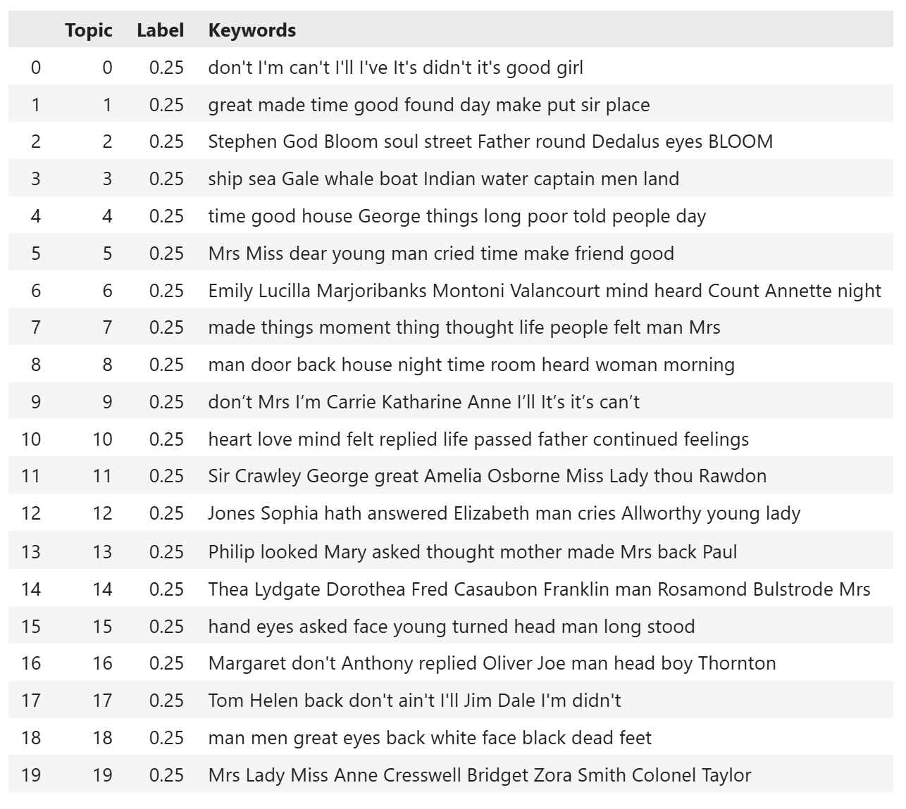

---

## Display the Top Documents in Each Topic

You can display the discovered topics and their top words using `get_top_docs()`. This method takes the following parameters:

- `topic`: The topic number to display.
- `n`: The number of top documents to return.
- `metadata`: A Dataframe with the metadata in the same order as the training data. This can include information such as document labels.
- `as_str`: Whether to return the result as a string instead of a pandas DataFrame. The default is `False`.

```python
mallet_model.get_top_docs(topic=0, n=10)
```

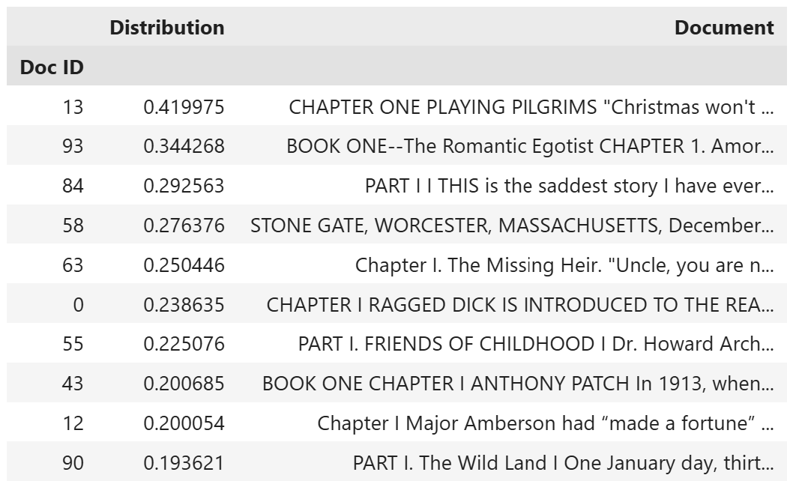

---

## Display the Topic Term Probabilities

You can display the the term distribution for a given topic with `get_topic_term_probabilities()`. This method takes the following parameters:

- `topics`: The topic number (or list of topic numbers) to display. If None, get the probabilities for all topics.
- `n`: The number of key terms to display.
- `as_df`: Whether to return the result as a string instead of a pandas DataFrame. The default is `False`.

```python
mallet_model.get_topic_term_probabilities(topics=[0, 1], n=10, as_df=True)
```

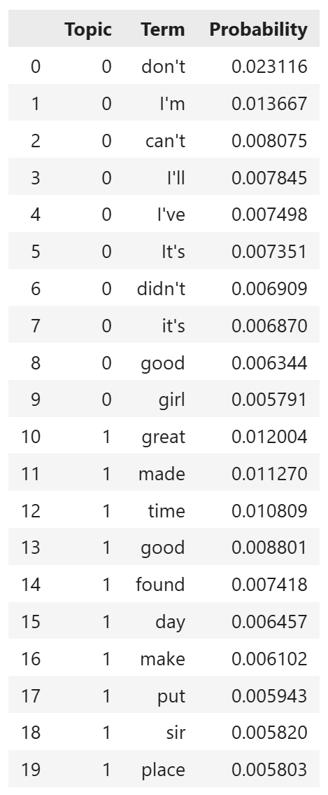

---

## Visualizing Topic-Term Weights with a Termite Plot

## Visualizing Topic-Term Weights with a Termite Plot

The `plot_termite()` method creates a termite plot using MALLET topic-term weights and the `textacy` visualization API. This view is especially useful for comparing important terms across multiple topics at once. For more information on termite plots, see Chuang, Jason, Christopher D. Manning, and Jeffrey Heer. “Termite: Visualization techniques for assessing textual topic models.” *Proceedings of the International Working Conference on Advanced Visual Interfaces*. ACM, 2012.

The method takes the following parameters:

- `topics`: Topic index or list of indices to include. If `None`, all topics are used.
- `highlight_topics`: Topic index, label, or list of topic indices/labels to visually emphasize.
- `n_terms`: Number of top terms to include in the plot.
- `rank_terms_by`: How terms are ranked before selection (for example, `"max"`, `"mean"`, `"var"`).
- `sort_terms_by`: How selected terms are ordered in the display (for example, `"seriation"`, `"weight"`, `"index"`, `"alphabetical"`).
- `title`: An optional title for the plot.
- `output_path`: Optional path for saving the figure.
- `rc_params`: Optional matplotlib style overrides passed to `textacy`.

```python
ax = mallet_model.plot_termite(
    topics=[0, 1, 2, 3],
    highlight_topics=[1],
    n_terms=20,
    sort_terms_by="seriation",
    output_path="termite_plot.png"
)
```

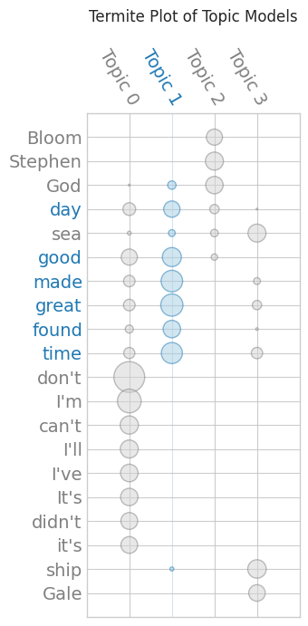

If `output_path` is omitted, the method returns the matplotlib axis so you can customize or display the figure in your notebook environment.

You can also use the `plot_termite_plotly` method to generate an interactive version. The Plotly version allows you to adjust the scaling of the circles with `marker_scale`. You can use this to minimize differences in appearance between the Plotly and the non-Plotly outputs.

```python
fig = mallet_model.plot_termite_plotly(
    topics=[0, 1, 2, 3],
    highlight_topics=[1],
    n_terms=20,
    rank_terms_by="max",
    sort_terms_by="seriation",
    marker_scale=25, # The default setting is 25, which can make the circles appear too large in some cases. Adjust as needed.
)
fig.show()
```

The `output_path` parameter saves to an HTML file.

<iframe src="images/termite_plot.html" width="100%" height="600px" style="border: none;"></iframe>

---

## Visualizing Topic Probabilities by Category with Boxplots

The `plot_categories_by_topic_boxplots()` method lets you visualize how topic probabilities are distributed across different categories (e.g., genres, labels, or other groupings). This is useful for understanding which topics are most associated with which categories in your data.

The function takes a number of parameters that allow you to choose your topics and categories, as well as to customize the appearance of the box plots.

- `categories`: List of category labels for each document (must match the order of your training data).
- `topics`: Topic index or list of indices to plot. If `None`, all topics are plotted.
- `output_path`: Path to save the figure. If `None`, the plot is shown but not saved.
- `target_labels`: List of unique category labels to include. If `None`, all categories are included.
- `num_keys`: Number of top keywords to display in the plot title.
- `figsize`: Size of the figure (tuple, e.g., `(8, 6)`).
- `font_scale`: Font scaling for the plot.
- `color`: Color for the boxplots (matplotlib color name or object).
- `show`: Whether to display the plot (`True`) or just return the figure object (`False`).
- `title`: Custom title for the plot. If not provided, a default is used.
- `overlay`: How to display individual data points (`'strip'`, `'swarm'`, or `'none'`).
- `overlay_kws`: Dictionary of keyword arguments for the overlay plot (e.g., point size, color).

**Overlay advice:**

- Use `'strip'` (default) for most cases, especially when you have a moderate number of documents per category. It shows individual points with jitter for visibility.
- Use `'swarm'` when you have a small number of documents and want to avoid overlapping points; it arranges points to minimize overlap.
- Use `'none'` if you only want to see the boxplot summary and not individual data points (useful for large datasets).

The cell below will run a basic example.

```python
categories = ["People", "Concepts", "People", "People", "People", "Battles", "Texts", "Texts", "Animals", "Planets", "People", "People"]
mallet_model.plot_categories_by_topic_boxplots(categories)
```

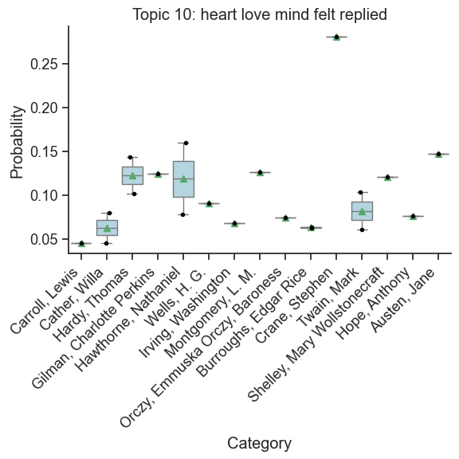

---

## Visualizing Topic-Category Associations with a Heatmap

The `plot_categories_by_topics_heatmap()` method creates a heatmap showing how topics are distributed across different categories. This is useful for quickly spotting which topics are most associated with which categories, especially when you have many topics or categories. It takes the following parameters:

- `categories`: List of category labels for each document (must match the order of your training data).
- `output_path`: Path to save the figure. If `None`, the plot is shown but not saved.
- `target_labels`: List of unique category labels to include. If `None`, all categories are included.
- `num_keys`: Number of top keywords to display in the topic labels.
- `figsize`: Size of the figure (tuple, e.g., `(10, 8)`).
- `font_scale`: Font scaling for the plot.
- `cmap`: Colormap for the heatmap (e.g., `"rocket_r"`, `"viridis"`, or any matplotlib colormap).
- `show`: Whether to display the plot (`True`) or just return the figure object (`False`).
- `title`: Custom title for the plot. If not provided, a default is used.

```python
categories = ["People", "Concepts", "People", "People", "People", "Battles", "Texts", "Texts", "Animals", "Planets", "People", "People"]
mallet_model.plot_categories_by_topics_heatmap(
    categories=categories,
    num_keys=3,
    figsize=(8, 6),
    font_scale=1,
    cmap="viridis",
    show=True,
    title="Topic-Category Heatmap"
)
```

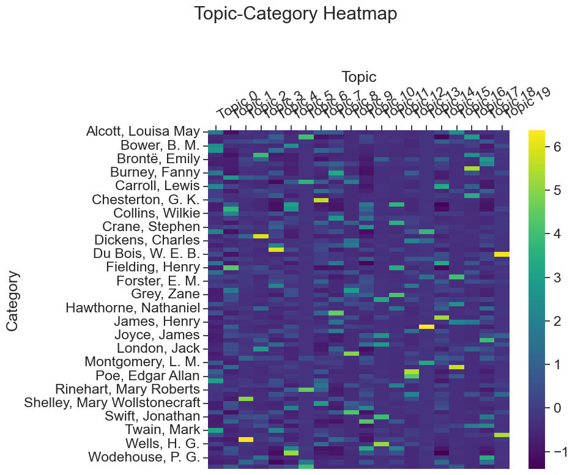


!!! Note
    If you make the figure size too small, some topic labels may be omitted. You can mitigate this by reducing the font scale.

---

## Visualizing Topics with Word Clouds

The `topic_clouds()` method in the Mallet class generates word clouds for each topic, providing a visual summary of the most important terms per topic. This is useful for quickly understanding the main themes captured by your model.

**Parameters:**

- `topics`: A topic number or list of topic numbers to include. If None, all topics are shown.
- `max_terms`: An optional maximum number of keywords per topic cloud (default: 30).
- `figsize`: An optional tuple (default: (10, 10)) specifying the size of the overall figure.
- `output_path`: An optional string specifying the path to save the figure.
- `show`: An optional boolean. If True, displays the figure; if False, returns the matplotlib Figure object.
- `round_mask`: An optional boolean or integer indicating whether to use a circular mask for the clouds (True/False or integer radius).
- `title`: An optional string specifying the title for the figure.
- `**kwargs`: Additional keyword arguments for customization (see below).

**Customization:**

- Pass `opts` in `**kwargs` to control word cloud appearance (e.g., background color, colormap). Accepts arguments for the Python <a href="https://amueller.github.io/word_cloud/generated/wordcloud.WordCloud.html#wordcloud.WordCloud" target="_blank">wordcloud</a> package.
- Pass `figure_opts` in `**kwargs` to control figure-level options using `matplotlib` (e.g., facecolor).

```python
mallet_model.topic_clouds(show=True)
```

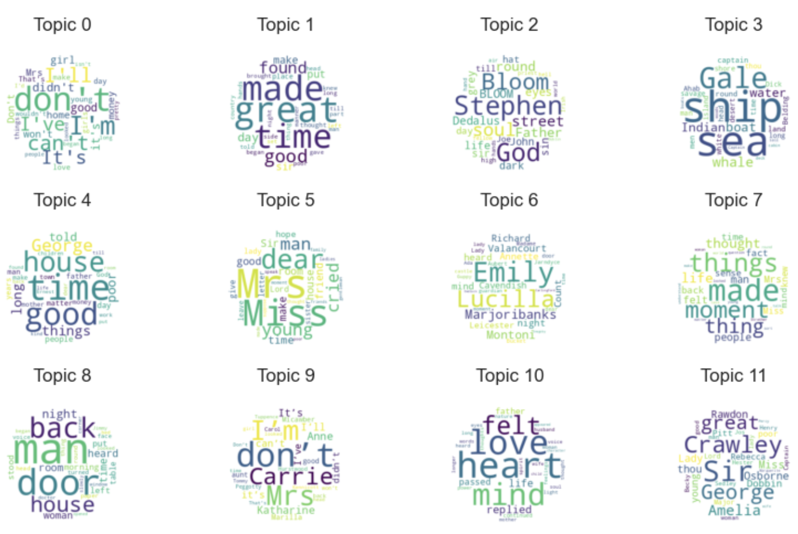

## Visualizing Topic Trends Over Time

The `plot_topics_over_time()` method in the Mallet class allows you to visualize how the probability of a specific topic changes across a sequence of documents, such as those ordered by time or another variable. This is useful for exploring temporal or sequential patterns in your corpus.

**Parameters:**

- `times`: A sequence of time points or other ordering variable, one per document.
- `topic_index`: An integer specifying the topic to plot (0-based index).
- `topic_distributions`: An optional list of lists of floats representing topic distributions per document. If None, uses the model's distributions.
- `topic_keys`: An optional list of lists of strings representing topic keys. If None, uses the model's keys.
- `output_path`: An optional string specifying the path to save the figure.
- `figsize`: An optional tuple specifying the size of the figure (default: (7, 2.5)).
- `font_scale`: An optional float specifying the Seaborn font scale (default: 1.2).
- `color`: An optional string specifying the line color (default: "cornflowerblue").
- `show`: An optional boolean. If True, displays the figure; if False, returns the matplotlib Figure object.
- `title`: An optional string specifying the title for the figure. If not supplied, uses topic keywords.

**Note:**

- The `times` list must be the same length and order as the documents in the training data.

```python
times = [2001, 2002, 2003, 2004, 2005, 2006, 2007, 2008, 2009, 2010, 2011, 2012]
mallet_model.plot_topics_over_time(times=times, topic_index=0, show=True)
```

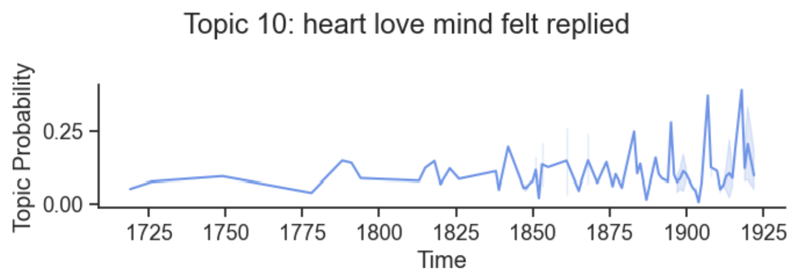

---

## Advanced: Infer Topics for New Documents

Sometimes you want train a model and then feed it new documents after training. To help you do this, Lexos creates an inferencer file when you initially train the model. It will automatically be saved as `inferencer.mallet` in your model's folder, but you can use the `path_to_inferencer` parameter when training your model (or change it in your metadata) if you want to give it a different name or save it somewhere else.

To use the inferencer to infer new topic distributions, you will need to define the following paths:

- `pipe_file`: Path to the `.mallet` pipe file created during training. Ensures new documents are processed identically to training data.
- `output_path`: Where to save the topic distributions for the new documents (as a text file).
- path_to_inferencer`: Path to the inferencer file created during training. This is used to infer topics for new documents.

In the example below, we read three texts from the `additional_texts` folder and define our paths relative to out model directory.

```python
# Read the new documents for inference
additional_dir = "additional_texts"
additional_docs = read_dirs(additional_dir)

# Define paths to your pipe file, output path, and inferencer file
pipe_file = mallet_model.model_dir / "training_data.mallet"
path_to_inferencer = mallet_model.metadata['path_to_inferencer']
output_path = mallet_model.model_dir / "new_doc_topics.txt"

# Use the Mallet class's infer() method to get topic distributions
inferred_topics = mallet_model.infer(additional_docs, path_to_inferencer=path_to_inferencer, use_pipe_from=pipe_file, output_path=output_path)

# Display the inferred topic distributions (also saved to the output_path)
print("First Two Distributions:")
for i, dist in enumerate(inferred_topics[:2]):
    print(f"Document {i}: {dist}\n")
```

This will output

```txt
Rewriting extended pipe from mallet_model/training_data.mallet
  Instance ID = aa26dc31-29d3-42b1-b4a1-89a31b9cb449
First Two Distributions:
Document 0: [0.03701587759523014, 0.22562284679833042, 0.011659133624194816, 0.002089723344164718, 0.05482355134447515, 0.3132625834708346, 0.0011246840846130227, 0.00875726731924916, 0.005425182463279581, 0.0013473854522018753, 0.1560084238479422, 0.014117284325535412, 0.10390895731894548, 0.005292742634827119, 0.0019167923579688285, 0.04280442602096767, 0.0013246091759711973, 0.004029924652703965, 0.008940321094880905, 0.0005282830736837843]

Document 1: [0.04276331790842658, 0.11287681572179306, 0.022736045794555307, 0.01648919393485762, 0.05502635415146537, 0.11588804624647527, 0.00856333391392494, 0.0890756981614076, 0.02915079847037649, 0.0010344730189665156, 0.18701993312212353, 0.012668273493168633, 0.012715348488343447, 0.041008989754911886, 0.011172857813115408, 0.15024808522457125, 0.006581476617065313, 0.00015573977570333965, 0.08273940381087777, 0.0020858145778706724]
```

Now combine the old and the new distributions. Since some of our visualization methods involve categories and times, we create categories and times lists that include our new documents.

```python
# Combine training and new distributions
all_distributions = mallet_model.distributions + inferred_topics

# Create a combined categories list (must match the length and order of all_distributions)
new_categories = ["Brontë, Charlotte", "Brontë, Charlotte", "Richardson, Samuel"]
all_categories = categories + new_categories

# Create a combined times list (must match the length and order of all_distributions)
new_times = [1846, 1853, 1740]
all_times = times + new_times
```

Now we can use any of the visualization methods. For instance, here are boxplots for the combined distributions:

```python
mallet_model.plot_categories_by_topic_boxplots(
    topics=3,
    categories=all_categories,
    topic_distributions=all_distributions,  # Pass the combined distributions
    show=True
)
```

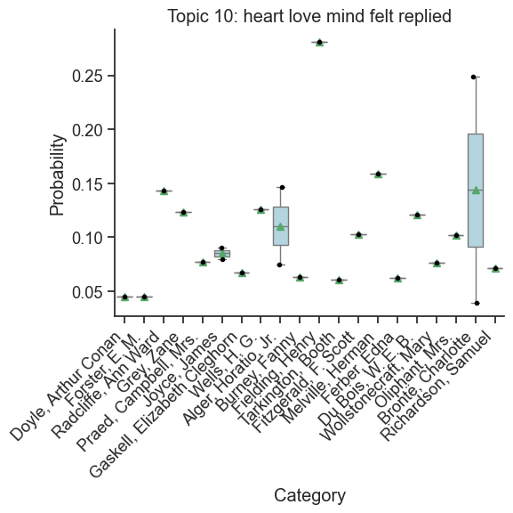

The code below will produce heatmap and topic over time visualizations.

```python
mallet_model.plot_categories_by_topics_heatmap(
    all_categories,
    topic_distributions=all_distributions,
    num_keys=3,
    figsize=(8, 6),
    font_scale=1,
    cmap="viridis",
    show=True,
    title="Topic-Category Heatmap (Combined Distributions)"
)
```

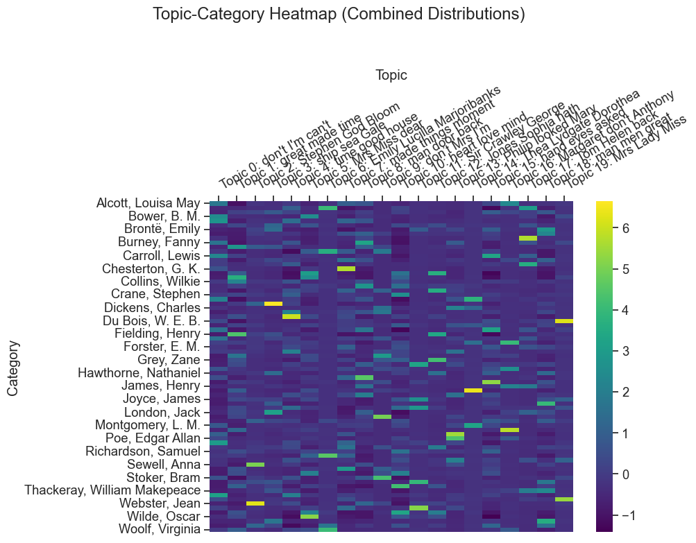

```python
times = [1846, 1853, 1740]
mallet_model.plot_topics_over_time(
    times=all_times,
    topic_index=0,
    topic_distributions=all_distributions,
    title="Topic 0 Trend (Combined Distributions)",
    color="blue",
    figsize=(10, 3),
    show=True
)
```

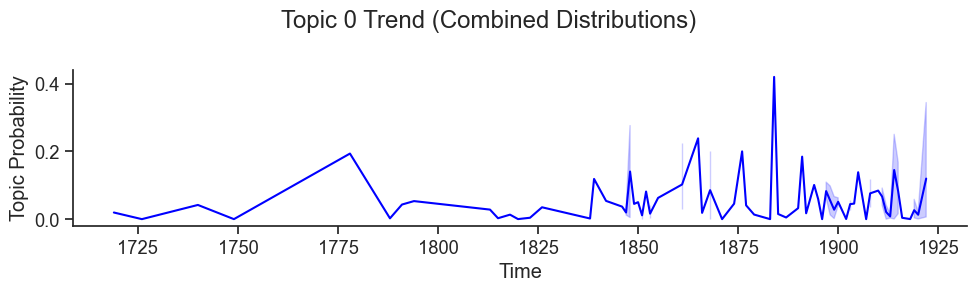
